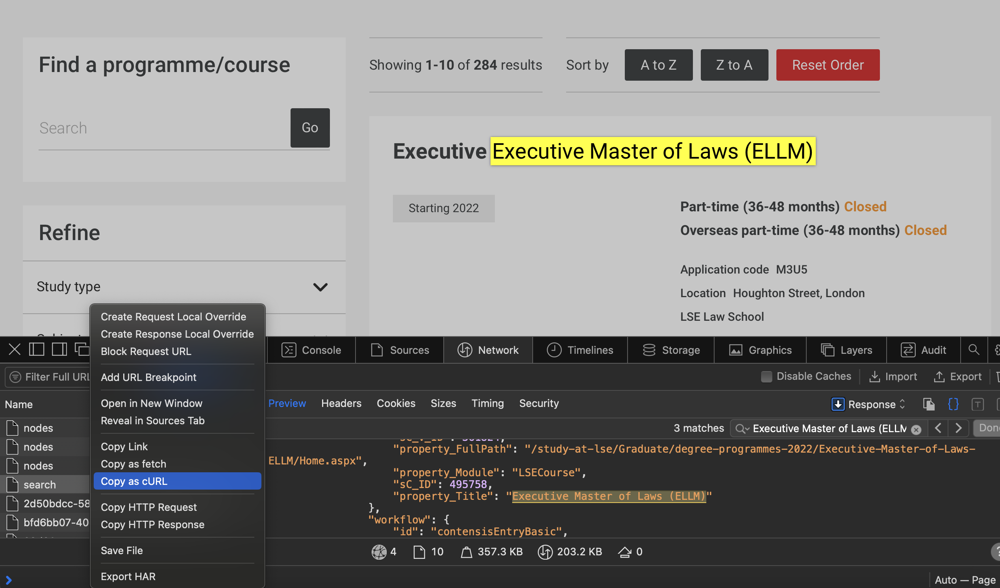

## Hidden APIs 

If you encounter a website that requires JavaScript to load the content, you can try to find the API that it uses to fetch the data. A more detailed walkthrough can be found [in our blog post on the subject](https://lse-dsi.github.io/DS105/blog/posts/scraping_unis.html), which deals with QS University Rankings. To keep with the LSE theme, we shall carry on investigating their backend. 

### Finding the API

This time, we will use the Network tab in the Developer Tools to find the API and copy it to Postman, a tool for API testing. If you have not used Postman before, you can download it [here](https://www.postman.com/downloads/).

1. Open the Developer Tools in your browser by right-clicking on the page and selecting "Inspect".
2. Click on the Network tab.
3. Refresh the page.
4. Filter the requests by XHR (XMLHttpRequest) to see only the API calls.
5. Look for the request that fetches the data you are interested in.
6. Right-click on the request and select "Copy as `cURL`".



The copied cURL command will be as follows:

```shell
curl 'https://www.lse.ac.uk/api/delivery/projects/website/entries/search?linkDepth=1&orderBy=%5B%7B%22asc%22%3A%22lsecYear%22%7D%5D&pageIndex=0&pageSize=10&where=%5B%7B%22field%22%3A%22sys.versionStatus%22%2C%22equalTo%22%3A%22published%22%7D%2C%7B%22or%22%3A%5B%7B%22field%22%3A%22includeInSearch%22%2C%22equalTo%22%3Atrue%7D%2C%7B%22field%22%3A%22includeInSearch%22%2C%22exists%22%3Afalse%7D%5D%7D%2C%7B%22or%22%3A%5B%7B%22and%22%3A%5B%7B%22not%22%3A%5B%7B%22field%22%3A%22searchDataUrl%22%2C%22contains%22%3A%22%2Farchive%22%7D%5D%7D%2C%7B%22not%22%3A%5B%7B%22field%22%3A%22searchDataUrl%22%2C%22contains%22%3A%22%2FArchive%22%7D%5D%7D%5D%7D%2C%7B%22field%22%3A%22searchDataUrl%22%2C%22exists%22%3Afalse%7D%5D%7D%2C%7B%22not%22%3A%5B%7B%22field%22%3A%22sys.uri%22%2C%22contains%22%3A%22%2Farchive%2F%22%7D%5D%7D%2C%7B%22not%22%3A%5B%7B%22field%22%3A%22sys.uri%22%2C%22contains%22%3A%22%2FArchive%2F%22%7D%5D%7D%2C%7B%22not%22%3A%5B%7B%22field%22%3A%22sys.uri%22%2C%22startsWith%22%3A%22%2FLSE-test-area%2F%22%7D%5D%7D%2C%7B%22not%22%3A%5B%7B%22field%22%3A%22sys.uri%22%2C%22startsWith%22%3A%22%2FzenTest%2F%22%7D%5D%7D%2C%7B%22not%22%3A%5B%7B%22field%22%3A%22sys.uri%22%2C%22startsWith%22%3A%22%2FTest%2F%22%7D%5D%7D%2C%7B%22not%22%3A%5B%7B%22field%22%3A%22sys.uri%22%2C%22startsWith%22%3A%22%2Ftest3%2F%22%7D%5D%7D%2C%7B%22not%22%3A%5B%7B%22field%22%3A%22sys.uri%22%2C%22startsWith%22%3A%22%2FTest-NS%2F%22%7D%5D%7D%2C%7B%22and%22%3A%5B%7B%22field%22%3A%22sys.dataFormat%22%2C%22equalTo%22%3A%22entry%22%7D%2C%7B%22field%22%3A%22sys.contentTypeId%22%2C%22in%22%3A%5B%22lseCourse%22%5D%7D%5D%7D%5D' \
-X 'GET' \
-H 'Content-Type: application/json; charset=utf-8' \
-H 'Accept: */*' \
-H 'Sec-Fetch-Site: same-origin' \
-H 'Accept-Language: en-GB,en;q=0.9' \
-H 'Accept-Encoding: gzip, deflate, br' \
-H 'Sec-Fetch-Mode: cors' \
-H 'Host: www.lse.ac.uk' \
-H 'User-Agent: Mozilla/5.0 (Macintosh; Intel Mac OS X 10_15_7) AppleWebKit/605.1.15 (KHTML, like Gecko) Version/17.3.1 Safari/605.1.15' \
-H 'Referer: https://www.lse.ac.uk/programmes/search-courses?pageIndex=1' \
-H 'Connection: keep-alive' \
-H 'Cookie: _ga_LWTEVFESYX=GS1.1.1714690126.5.1.1714691263.60.0.0; ga_session_duration=61; _hjSession_630321=eyJpZCI6ImQ5YWViZjViLTYxMGUtNGRmMC1iNTYwLWExYThlODVjNDE5NiIsImMiOjE3MTQ2OTAxMjY3NDIsInMiOjAsInIiOjAsInNiIjowLCJzciI6MCwic2UiOjAsImZzIjowLCJzcCI6MH0=; __utma=240658078.69005341.1714148844.1714671430.1714690127.5; __utmb=240658078.3.10.1714690127; __utmc=240658078; __utmz=240658078.1714569557.2.2.utmcsr=google|utmccn=(organic)|utmcmd=organic|utmctr=(not%20provided); _fbp=fb.2.1714501546547.1990712021; _ga=GA1.1.69005341.1714148844; _gid=GA1.3.176997484.1714666497; _hjSessionUser_630321=eyJpZCI6ImIwOWQ2MjQ5LTMzYmEtNWVjNC04ZjZjLTIzNzMzYzg3NWY3OCIsImNyZWF0ZWQiOjE3MTQ1MDE1NDY1NzIsImV4aXN0aW5nIjp0cnVlfQ==; _rdt_uuid=1714501546013.6cada3fd-3c12-4aec-8132-894aa3f39881; __utmt_UA-1994817-8=1; Hm_lpvt_f032a95391516195721863be4e7b5faf=1714690128; Hm_lvt_f032a95391516195721863be4e7b5faf=1714690128; _uetsid=228fe84008d611ef88cb333b3d5e2786; _uetvid=22900ee008d611ef999a690944ddfca9; cb-enabled=enabled; _tt_enable_cookie=1; _ttp=hJYeHUcmUxiszcfA_23sOEC6jM8; _hjSessionUser_864760=eyJpZCI6IjNhMTYzODhhLTQwNWMtNTk2ZC1iYWEwLWNiYWE1YTNlYjM5MCIsImNyZWF0ZWQiOjE3MTQxNDg2MDIxMTksImV4aXN0aW5nIjp0cnVlfQ==; optimizelyEndUserId=oeu1714148601882r0.6696495259490041; _ga_0HYE8YG0M6=GS1.1.1714148844.1.1.1714148910.0.0.0; _ga_4819PJ6HEN=GS1.1.1714148843.1.1.1714148910.0.0.0; _gcl_au=1.1.2058369310.1714148844' \
-H 'Sec-Fetch-Dest: empty' \
-H 'accesstoken: gnIlDXEa99dkods6o6PZfZ3vAVrBqeUecgrywqZ00SUDwRi7'
```

You can see that it's full of URL-encoded characters, which makes it hard to read. You can use a tool like [the URL Decoder](https://www.urldecoder.org) to convert it to a more readable format, which will look like this:

```shell
https://www.lse.ac.uk/api/delivery/projects/website/entries/search?linkDepth=1&orderBy=[{"asc":"lsecYear"}]&pageIndex=0&pageSize=10&where=[{"field":"sys.versionStatus","equalTo":"published"},{"or":[{"field":"includeInSearch","equalTo":true},{"field":"includeInSearch","exists":false}]},{"or":[{"and":[{"not":[{"field":"searchDataUrl","contains":"/archive"}]},{"not":[{"field":"searchDataUrl","contains":"/Archive"}]}]},{"field":"searchDataUrl","exists":false}]},{"not":[{"field":"sys.uri","contains":"/archive/"}]},{"not":[{"field":"sys.uri","contains":"/Archive/"}]},{"not":[{"field":"sys.uri","startsWith":"/LSE-test-area/"}]},{"not":[{"field":"sys.uri","startsWith":"/zenTest/"}]},{"not":[{"field":"sys.uri","startsWith":"/Test/"}]},{"not":[{"field":"sys.uri","startsWith":"/test3/"}]},{"not":[{"field":"sys.uri","startsWith":"/Test-NS/"}]},{"and":[{"field":"sys.dataFormat","equalTo":"entry"},{"field":"sys.contentTypeId","in":["lseCourse"]}]}]'
```

This is telling us that the API is filtering our request based on the `sys.contentTypeId` field, which is set to `lseCourse`. Once you have identified the URL structure, you can try deleting some of the parameters to see whether the request still works. If it does, you can simplify the URL. 

Pay particular attention to whether it is a `GET` or `POST` request: 

- `GET` requests take search parameters in the URL, and are often URL-encoded. If you need to change them, you can pass them as a dictionary to the `params` argument in the `requests.get()` function.
- `POST` requests take search parameters in the body of the request, and are often JSON-encoded. If you need to change them, you can pass them as a dictionary to the `data` argument in the `requests.post()` function or the equivalent in Scrapy. 

### Being clever about pagination

Hidden APIs often contain the total number of results returned by a query, so you know how many pages you need to traverse. Also, it is often the case that you might be able to access all the results in a single request by setting the `pageSize` parameter to a high enough number. In our case, we have 284 results that are easily obtainable in a single request. 

If you do need to paginate, you can use the `pageIndex` parameter. Let's assume that we cannot access all of the results at once for the sake of practice. You can still use Scrapy to take advantage of the following: 

- **Asynchronous requests**: Scrapy can send multiple requests at once, which can speed up the process.
- **Caching**: Scrapy can cache the results of the requests, so you don't have to make the same request multiple times.
- **Error handling**: Scrapy can handle errors gracefully, so you don't have to worry about your spider crashing if a request fails.
- **File formats**: Scrapy is format-agnostic and can output the results in JSON, JSON lines, CSV, and XML.

## Writing the spider

Here things are a bit different. Instead of roviding the `start_urls` list, we shall define a `start_requests` method that will yield the first requests to the API. We will also define a `parse` method that will handle the response. 

If you need to encode some URL parameters, you can send a `scrapy.FormRequest` object instead of a `scrapy.Request` and provide it with the `formdata` argument, which is your encoded dictionary. 

The `self.parse` method could not be simpler: it simply reads in the JSON response and yields the resulting dictionary. 

After this, you can run the `scrapy crawl` command as usual and save the results to a file. 

## Post scriptum 

There are many more options for Scrapy which we have not had the chance to cover. Some notable examples include:

- **Middlewares**: You can use middlewares to modify the requests and responses, for example to add headers or change the user agent.

- **Pipelines**: You can use pipelines to process the items that are scraped, for example to save them to a database. 

- **Settings**: You can change the settings of the spider, for example to set the download delay or the maximum number of concurrent requests.

- **Sitemap spiders**: Some sites contain a complete list of links to scrape in `example.com/sitemap.xml`. This could save you countless hours of trying to find paginate---you can simply filter the URLs present in the sitemap using `LinkExtractor`.

- **Crawl spiders**: You can use crawling rules to define which URLs to follow and which ones to ignore.

There are plenty of Scrapy resources online, but my personal favourite is [John Watson Rooney's YouTube channel](https://www.youtube.com/@JohnWatsonRooney). 

Happy scraping!
